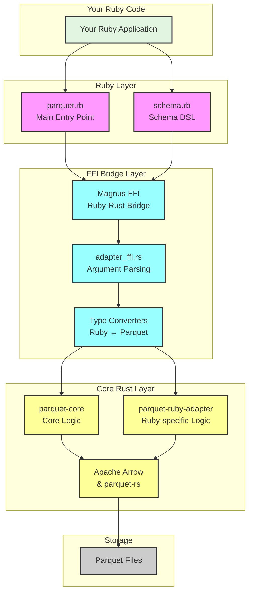
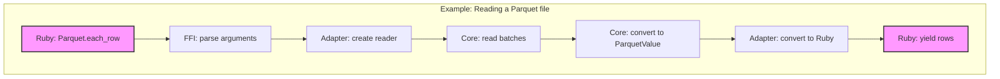
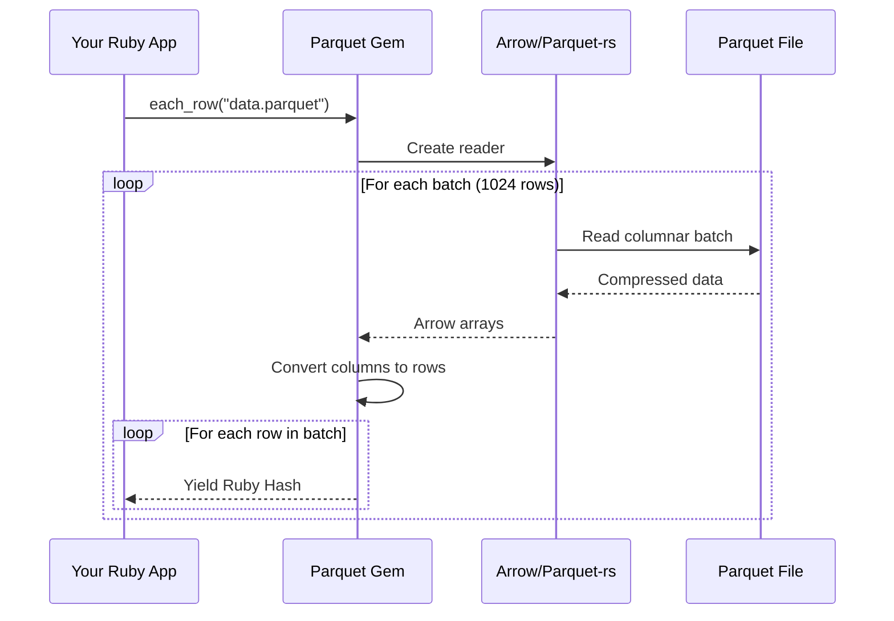
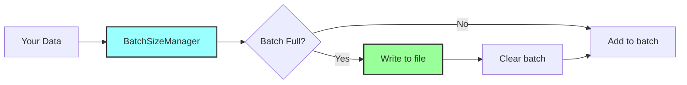

# Parquet Ruby Gem Architecture Guide

Welcome to the architecture documentation for the Parquet Ruby gem! This guide will help you understand how the library works internally and where to find important components.


## Table of Contents

1. [Quick Start for Developers](#quick-start-for-developers)
2. [High-Level Architecture](#high-level-architecture)
3. [The Three Core Components](#the-three-core-components)
4. [How Data Flows Through the System](#how-data-flows-through-the-system)
5. [Ruby and Parquet Type Conversions](#ruby-and-parquet-type-conversions)
6. [Important Implementation Details](#important-implementation-details)
7. [Deep Dive: Module Reference](#deep-dive-module-reference)
8. [Development Guide](#development-guide)

---

## Quick Start for Developers

If you're looking to contribute or understand specific parts of the codebase, here's where to find things:

### 📍 Key Files and Their Purpose

| What you're looking for | Where to find it | File/Module |
|------------------------|------------------|-------------|
| Ruby API entry points | Ruby layer | `lib/parquet.rb` |
| Schema DSL | Ruby layer | `lib/parquet/schema.rb` |
| FFI bindings | Rust FFI layer | `ext/parquet/src/adapter_ffi.rs` |
| Core reading logic | Core library | `parquet-core/src/reader.rs` |
| Core writing logic | Core library | `parquet-core/src/writer.rs` |
| Ruby↔Parquet conversions | Adapter layer | `parquet-ruby-adapter/src/converter.rs` |
| Type definitions | Core library | `parquet-core/src/types.rs` |
| Memory management | Various | `batch_manager.rs`, `allocator.rs` |

### 🔧 Common Development Tasks

**Want to add a new Ruby API method?**
1. Add the Ruby method in `lib/parquet.rb`
2. Create FFI wrapper in `ext/parquet/src/adapter_ffi.rs`
3. Implement logic in appropriate `parquet-ruby-adapter` module

**Need to support a new data type?**
1. Add to `ParquetValue` enum in `parquet-core/src/types.rs`
2. Update conversions in `parquet-ruby-adapter/src/converter.rs`
3. Add Arrow conversions in `parquet-core/src/arrow_conversion.rs`

**Debugging memory issues?**
- Check `BatchSizeManager` in `parquet-ruby-adapter/src/batch_manager.rs`
- Review platform allocators in `ext/parquet/src/allocator.rs`
- Look at string caching in `parquet-ruby-adapter/src/string_cache.rs`

**Understanding the flow?**
- Start at `lib/parquet.rb` to see the Ruby API
- Follow method calls into `adapter_ffi.rs`
- Trace through to the relevant module in `parquet-ruby-adapter`
- Core logic lives in `parquet-core`

---

## High-Level Architecture

The Parquet Ruby gem is built as a three-layer architecture that cleanly separates concerns:

### The Three Layers

1. **Ruby Layer** - What Ruby developers interact with
   - Pure Ruby code providing the public API
   - Schema DSL for defining table structures
   - Handles Ruby-specific concerns

2. **FFI Bridge Layer** - The translation layer
   - Converts between Ruby and Rust types
   - Manages the Ruby GIL (Global Interpreter Lock)
   - Handles memory safety between languages

3. **Core Rust Layer** - The heavy lifting
   - High-performance Parquet reading/writing
   - Integration with Apache Arrow for columnar processing
   - Memory-efficient streaming operations

### Visual Overview



### Why This Architecture?

This layered approach provides several benefits:

- **Performance**: Core logic in Rust for maximum speed
- **Safety**: FFI bridge carefully manages memory between languages
- **Flexibility**: Ruby layer provides idiomatic API
- **Maintainability**: Clear separation of concerns
- **Reusability**: Core library could support other language bindings

---

## The Three Core Components

The codebase is organized as a Rust workspace with three distinct crates, each with a specific purpose:

### 1. ext/parquet - The FFI Extension

**Purpose**: This is the glue between Ruby and Rust.


**Key responsibilities:**
- Registers Ruby methods using Magnus (Ruby-Rust bridge)
- Parses Ruby arguments and converts them to Rust types
- Handles errors and converts them to Ruby exceptions
- Platform-specific memory allocator configuration

**Important files:**
- `lib.rs` - Entry point, registers Ruby module
- `adapter_ffi.rs` - Thin wrappers for each Ruby method
- `allocator.rs` - Memory allocator setup (jemalloc on Linux, mimalloc elsewhere)

### 2. parquet-ruby-adapter - Ruby-Specific Logic

**Purpose**: Handles all Ruby-specific concerns that the core library shouldn't know about.

**Key modules:**
- `converter.rs` - Converts Ruby values to/from Parquet values
- `io.rs` - Wraps Ruby IO objects for Rust to use
- `schema.rs` - Parses Ruby schema definitions
- `batch_manager.rs` - Smart batching for memory efficiency
- `string_cache.rs` - Interns strings in Ruby VM for memory savings

### 3. parquet-core - The Engine

**Purpose**: Pure Rust implementation of Parquet operations. Language-agnostic.

**Core components:**
- `reader.rs` - High-performance file reading
- `writer.rs` - Efficient file writing with compression
- `types.rs` - Comprehensive type system (`ParquetValue` enum)
- `arrow_conversion.rs` - Converts between Arrow arrays and Parquet values
- `schema.rs` - Type-safe schema representation

### How They Work Together



## How Data Flows Through the System

Understanding how data moves through the library helps when debugging or adding features.

### Reading Parquet Files

The library supports two reading modes:

#### 1. Row-by-Row Reading (`each_row`)

Best for: Processing records individually, data transformations

```ruby
Parquet.each_row("data.parquet") do |row|
  # row is a Hash with column names as keys
  puts row["name"]
end
```

**What happens internally:**



**Key points:**
- Reads data in batches of 1024 rows for efficiency
- Converts columnar data to row format on-the-fly
- Memory efficient - only one batch in memory at a time

#### 2. Column-by-Column Reading (`each_column`)

Best for: Analytics, aggregations, columnar operations

```ruby
Parquet.each_column("data.parquet", batch_size: 5000) do |columns|
  # columns is a Hash with column names as keys
  # Each value is an array of values for that batch
  sum = columns["amount"].sum
end
```

**What happens internally:**
- Reads data in its native columnar format
- More efficient for analytical workloads
- Configurable batch size (default 1000 rows)

### Writing Parquet Files

The library supports both row-oriented and column-oriented writing:

#### Row-Oriented Writing (`write_rows`)

Most common approach for typical Ruby applications:

```ruby
schema = {
  "name" => {type: "string"},
  "age" => {type: "int32"},
  "active" => {type: "boolean"}
}

data = [
  {"name" => "Alice", "age" => 30, "active" => true},
  {"name" => "Bob", "age" => 25, "active" => false}
]

Parquet.write_rows("output.parquet", schema, data)
```

**Smart Memory Management:**

The writer uses an intelligent batching system to prevent memory issues:



**How the BatchSizeManager works:**
1. Samples first 100 rows to estimate average row size
2. Calculates optimal batch size to stay under memory threshold (default 80MB)
3. Continuously adjusts based on actual data
4. Ensures minimum batch size of 10 rows for efficiency

#### Column-Oriented Writing (`write_columns`)

More efficient when you already have columnar data:

```ruby
columns = {
  "name" => ["Alice", "Bob", "Charlie"],
  "age" => [30, 25, 35],
  "active" => [true, false, true]
}

Parquet.write_columns("output.parquet", schema, columns)
```

### Compression Options

The library supports multiple compression algorithms:

- `snappy` (default) - Fast compression/decompression
- `gzip` - Better compression ratio, slower
- `brotli` - Best compression ratio, slowest
- `lz4` - Very fast, decent compression
- `zstd` - Good balance of speed and compression
- `uncompressed` - No compression

## Ruby and Parquet Type Conversions

Understanding type mappings is crucial for working with Parquet files.

### Basic Type Mappings

| Ruby Type | Parquet Type Options | Notes |
|-----------|---------------------|-------|
| Integer | int8, int16, int32, int64, uint8-64 | Choose based on value range |
| Float | float32, float64 | float32 for memory savings |
| String | string, binary, uuid | UTF-8 for string, arbitrary bytes for binary |
| Time | timestamp_*, time_* | Multiple precision levels available |
| Date | date32, date64 | date32 is days since epoch |
| BigDecimal | decimal128, decimal256 | Preserves precision |
| true/false | boolean | - |
| nil | null | Allowed if field is nullable |
| Array | list | Nested arrays supported |
| Hash | map, struct | map for key-value, struct for fixed fields |

### Practical Examples

```ruby
# Integer types - choose based on your data range
schema = {
  "small_number" => {type: "int8"},     # -128 to 127
  "medium_number" => {type: "int32"},   # -2^31 to 2^31-1
  "large_number" => {type: "int64"},    # -2^63 to 2^63-1
  "positive_only" => {type: "uint32"}   # 0 to 2^32-1
}

# Timestamp types - choose based on precision needs
schema = {
  "created_at" => {type: "timestamp_millis"},     # Millisecond precision
  "high_precision" => {type: "timestamp_nanos"},  # Nanosecond precision
  "with_timezone" => {type: "timestamp_millis", timezone: "UTC"}
}

# Complex types
schema = {
  "tags" => {type: "list<string>"},
  "metadata" => {type: "map<string,string>"},
  "address" => {
    type: "struct",
    fields: [
      {name: "street", type: "string"},
      {name: "city", type: "string"},
      {name: "zip", type: "int32"}
    ]
  }
}
```

### Type Conversion Details

The conversion happens in `parquet-ruby-adapter/src/converter.rs`:

1. **Ruby to Parquet**: The converter examines the Ruby value and schema to determine the correct Parquet type
2. **Type Validation**: Ensures Ruby values match schema expectations
3. **Automatic Conversions**: Some types are automatically converted (e.g., Ruby Integer to appropriate int size)
4. **Error Handling**: Type mismatches result in clear error messages

### Schema Definition

The library supports three ways to define schemas:

#### 1. Hash Format (Recommended)

```ruby
schema = {
  "name" => {type: "string", nullable: false},
  "age" => {type: "int32"},
  "email" => {type: "string", nullable: true}
}
```

#### 2. DSL Format

```ruby
schema = Parquet::Schema.define do
  column "name", :string, nullable: false
  column "age", :int32
  column "email", :string, nullable: true
end
```

#### 3. Legacy Array Format

```ruby
# Still supported for backward compatibility
schema = [
  {name: "name", type: "string", nullable: false},
  {name: "age", type: "int32"},
  {name: "email", type: "string", nullable: true}
]
```

---

## Important Implementation Details

### Timestamp and Timezone Handling ⚠️

**Critical limitation from the Parquet specification:**

Parquet can only store timestamps in two ways:
1. **UTC-normalized** (`isAdjustedToUTC = true`) - When ANY timezone is specified
2. **Local/unzoned** (`isAdjustedToUTC = false`) - When NO timezone is specified

**What this means for you:**

```ruby
# Writing with timezone - timezone info is LOST!
schema = {"time" => {type: "timestamp_millis", timezone: "+09:00"}}
data = [{"time" => Time.now}]  # e.g., 2024-01-01 09:00:00 +0900
# Written as: 2024-01-01 00:00:00 UTC (converted to UTC, timezone lost)

# Reading back
Parquet.each_row("file.parquet") do |row|
  puts row["time"]  # 2024-01-01 00:00:00 UTC (no +09:00!)
end
```

**Workaround:** Store timezone separately if needed:
```ruby
schema = {
  "time" => {type: "timestamp_millis", timezone: "UTC"},
  "timezone" => {type: "string"}
}
```

### Memory Allocators

The library uses platform-specific allocators for performance:

- **Linux**: jemalloc (with `disable_initial_exec_tls` for Ruby compatibility)
- **macOS/Unix**: mimalloc
- **Windows**: System allocator

Configured in `ext/parquet/src/allocator.rs`.

### Thread Safety

Key considerations:
- Ruby GIL is properly managed in FFI layer
- String cache is thread-safe (Arc<Mutex>)
- IO operations are wrapped for thread safety
- Parquet reading can use multiple threads internally

### String Interning

The library automatically interns strings in Ruby's VM for memory efficiency:
- Duplicate strings share memory in Ruby
- Cache statistics available for debugging
- Happens transparently during reading

---

## Deep Dive: Module Reference

For developers who need to understand or modify specific components.

### Memory Management Architecture


**Key components:**

1. **BatchSizeManager** (`batch_manager.rs`)
   - Uses reservoir sampling for size estimation
   - Dynamically adjusts batch sizes
   - Prevents OOM errors on large datasets

2. **Platform Allocators** (`allocator.rs`)
   - Linux: jemalloc with Ruby-compatible flags
   - Others: mimalloc for performance

3. **StringCache** (`string_cache.rs`)
   - Interns strings in Ruby VM
   - Reduces memory usage for repeated strings
   - Thread-safe with performance metrics

### IO Handling

The library handles various input sources intelligently:

```ruby
# File path - most efficient
Parquet.each_row("/path/to/file.parquet")

# Ruby IO object - works with any IO
File.open("file.parquet", "rb") do |f|
  Parquet.each_row(f)
end

# In-memory string
data = File.read("file.parquet")
Parquet.each_row(data)
```

**How it works:**
- File paths: Direct memory-mapped access
- Seekable IO: Wrapped with thread safety
- Non-seekable IO: Copied to temp file first
- Strings: Treated as in-memory buffers

### Detailed Crate Descriptions

#### ext/parquet - FFI Extension

**What it does:** The glue between Ruby and Rust.

**Key files:**
- `lib.rs` - Registers Ruby methods
- `adapter_ffi.rs` - Thin wrappers for each Ruby method
- `allocator.rs` - Memory allocator setup

**Design principle:** Keep it minimal - just parse arguments and delegate to the adapter crate.

#### parquet-core - Core Library

**What it does:** Pure Rust implementation of Parquet operations. Language-agnostic.

**Key modules:**
- `reader.rs` - High-performance file reading
- `writer.rs` - Efficient writing with compression
- `types.rs` - The `ParquetValue` enum (all Parquet types)
- `arrow_conversion.rs` - Converts between Arrow and Parquet formats
- `schema.rs` - Type-safe schema representation

**Special note about arrow_conversion.rs:**
This module is the single source of truth for all type conversions. It eliminated 900+ lines of duplicate code by consolidating conversion logic used by both reader and writer.

**Design principles:**
- Zero-cost abstractions
- Type safety at compile time
- Memory-efficient streaming
- No Ruby-specific code

#### parquet-ruby-adapter - Ruby Integration

**What it does:** All Ruby-specific logic that the core library shouldn't know about.

**Key modules and their purpose:**

| Module | Purpose | Key Features |
|--------|---------|-------------|
| `converter.rs` | Ruby ↔ Parquet conversions | Handles BigDecimal, Time, UUID, etc. |
| `io.rs` | Ruby IO wrapper | Makes Ruby IO objects work with Rust |
| `schema.rs` | Schema parsing | Supports DSL, hash, and array formats |
| `batch_manager.rs` | Smart batching | Prevents OOM with large datasets |
| `string_cache.rs` | String interning | Saves memory in Ruby VM |
| `reader.rs` | Read operations | Row and column iteration |
| `writer.rs` | Write operations | Handles batching and compression |
| `chunk_reader.rs` | Parallel reading | Enables multi-threaded operations |
| `types.rs` | Type definitions | Common structs and enums |
| `utils.rs` | Helper functions | Argument parsing, memory estimation |

**Design notes:**
- Manages Ruby GIL properly
- Thread-safe where needed
- Handles non-seekable IO by copying to temp files

---

## Development Guide

### Building and Testing

```bash
# Build the Rust extension
direnv exec . rake compile

# Run all tests
direnv exec . rake test

# Run specific Ruby test
direnv exec . ruby -Ilib:test test/parquet_test.rb

# Run Rust tests
direnv exec . cargo nextest run
```

### Common Development Scenarios

#### Adding a New Schema Type

1. Update `ParquetValue` enum in `parquet-core/src/types.rs`
2. Add conversion logic in `parquet-ruby-adapter/src/converter.rs`
3. Update Arrow conversions in `parquet-core/src/arrow_conversion.rs`
4. Add tests for the new type

#### Debugging Type Conversion Issues

1. Check `converter.rs` for Ruby → Parquet logic
2. Look at `arrow_conversion.rs` for Parquet ↔ Arrow logic
3. Enable debug logging to see conversion steps
4. Use `Parquet.metadata` to inspect file schemas

#### Memory Optimization

1. Review `BatchSizeManager` settings in `batch_manager.rs`
2. Check string cache hit rates in logs
3. Profile with Ruby memory profilers
4. Consider adjusting batch sizes for your use case

### Error Handling Philosophy

The library follows these principles:

1. **Fail fast with clear messages** - Type mismatches are caught early
2. **Preserve context** - Errors include file names, column names, etc.
3. **Map to Ruby exceptions** - IOError, TypeError, etc. as appropriate
4. **No silent failures** - All errors are propagated to Ruby

### Performance Tips

1. **Use appropriate batch sizes** - Larger batches are faster but use more memory
2. **Choose the right compression** - Snappy for speed, gzip/brotli for size
3. **Project columns** - Only read columns you need
4. **Use column iteration** - More efficient for analytics

### Contributing

When contributing:

1. Follow existing patterns in the codebase
2. Add tests for new functionality
3. Update this ARCH.md if you change architecture
4. Run `cargo fmt` and `cargo clippy` before submitting
5. Ensure all tests pass on Linux, macOS, and Windows

---

## Conclusion

This architecture provides a clean separation between Ruby and Rust concerns while maintaining high performance. The three-layer design allows for:

- Easy maintenance and debugging
- Potential reuse of the core library for other languages
- Clear ownership of different concerns
- Type-safe, memory-safe operations

For questions or clarifications, please refer to the inline documentation in the source code or open an issue on GitHub.
