# Parquet Ruby Gem Architecture Documentation

This document provides a comprehensive overview of the Parquet Ruby gem's architecture, including detailed diagrams and descriptions of how data flows through the system.

## Table of Contents
1. [Architecture Overview](#architecture-overview)
2. [Component Architecture](#component-architecture)
3. [Data Flow Diagrams](#data-flow-diagrams)
4. [Type System and Conversions](#type-system-and-conversions)
5. [Memory Management](#memory-management)
6. [Crate Descriptions](#crate-descriptions)
7. [Key Design Patterns](#key-design-patterns)

## Architecture Overview

The Parquet Ruby gem provides high-performance Parquet file reading and writing capabilities by wrapping the official Apache parquet-rs Rust crate through FFI. The architecture consists of three main layers:

### Timestamp and Timezone Handling

**PARQUET SPECIFICATION LIMITATION**: The Apache Parquet format specification defines only two types of timestamp storage:
1. **UTC-normalized timestamps** (`isAdjustedToUTC = true`) - When ANY timezone is present in the schema
2. **Local/unzoned timestamps** (`isAdjustedToUTC = false`) - When NO timezone is present in the schema

This means Parquet CANNOT preserve specific timezone information like "+09:00" or "America/New_York". This is defined in the Parquet specification, not a limitation of this Ruby implementation.

#### When Writing
- Schema WITH timezone (e.g., "UTC", "+09:00", "America/New_York"):
  - ALL timestamps are converted to UTC
  - Stored with `isAdjustedToUTC = true`
  - Original timezone offset is LOST (e.g., "+09:00" becomes "UTC")
- Schema WITHOUT timezone:
  - Timestamps stored as local/unzoned time (no conversion)
  - Stored with `isAdjustedToUTC = false`
  - Represents "wall clock" time without timezone context

#### When Reading
- Files with `isAdjustedToUTC = true` (had ANY timezone when written):
  - Time objects returned in UTC
  - Original timezone is NOT recoverable (was lost during write)
- Files with `isAdjustedToUTC = false` (had NO timezone):
  - Time objects returned as local time in system timezone
  - These are "wall clock" times without timezone information
- Date32 fields are returned as Ruby Date objects (timezone-agnostic)

**Workaround**: If you need to preserve timezone information, store it separately as a string column alongside the timestamp.

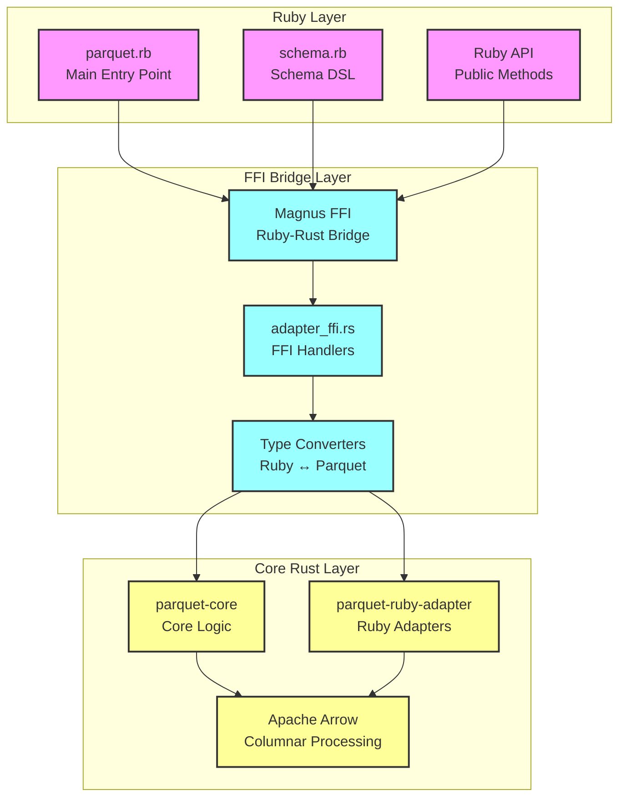

## Component Architecture

### Workspace Structure

The project uses a Rust workspace with three crates:

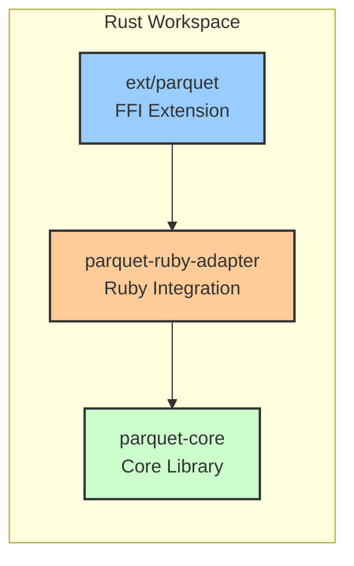

### Module Hierarchy

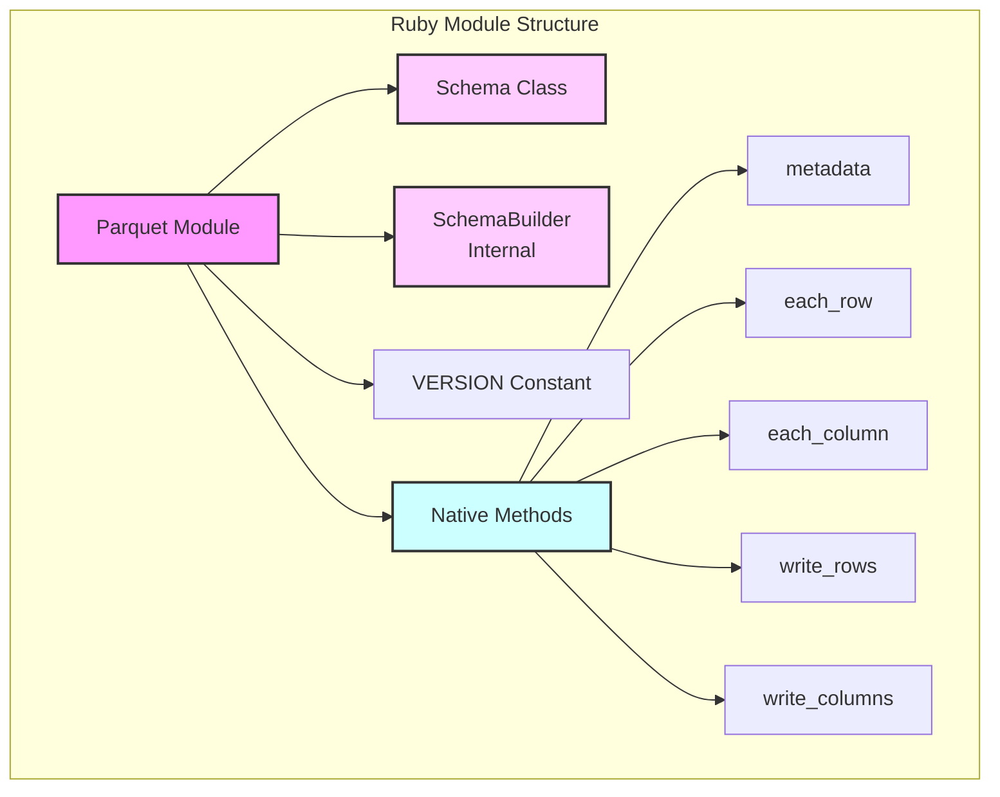

## Data Flow Diagrams

### Read Operation Flow

#### Row-wise Reading

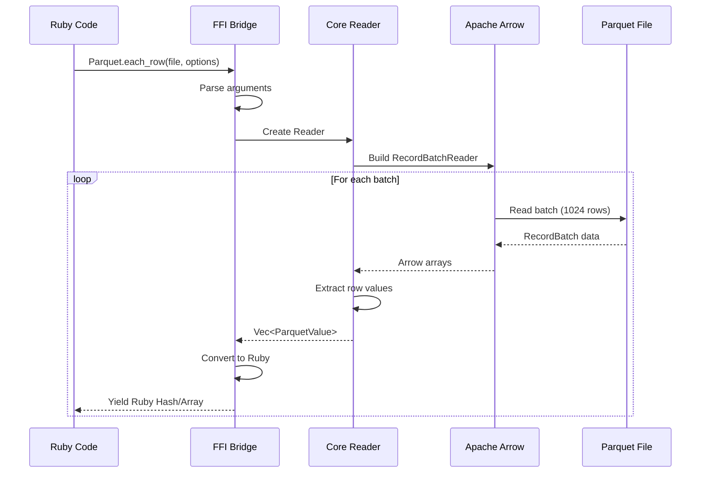

#### Column-wise Reading

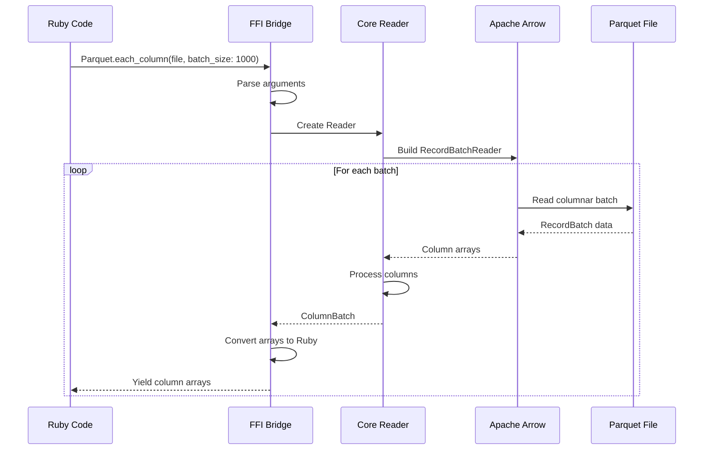

### Write Operation Flow

#### Row-wise Writing

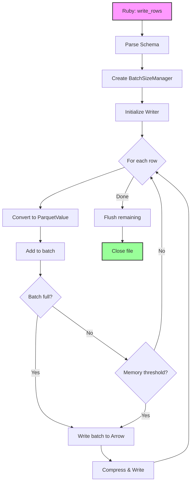

#### Dynamic Batch Size Management (Reservoir Sampling)

```mermaid
graph TD
    A[Start Writing] --> B[Sample First 100 Rows<br/>Using Reservoir Sampling]
    B --> C[Calculate Average Row Size]
    C --> D[Set Initial Batch Size<br/>target_memory_usage / avg_row_size]

    D --> E{Writing Rows}
    E --> F[Track Recent Row Sizes<br/>in samples array]
    F --> G{Samples >= 10?}

    G -->|Yes| H[Recalculate Average<br/>from Recent Samples]
    G -->|No| I[Continue with Current Size]

    H --> J[Adjust Batch Size<br/>min(10, calculated_size)]
    J --> I
    I --> K{Memory Threshold?<br/>batch_memory_usage > threshold}

    K -->|Yes| L[Flush Batch]
    K -->|No| E

    L --> E

    style A fill:#f9f,stroke:#333,stroke-width:2px
    style L fill:#ff9,stroke:#333,stroke-width:2px
```

## Type System and Conversions

### Type Conversion Flow

```mermaid
graph LR
    subgraph "Ruby to Parquet"
        A1[Ruby Integer] --> B1[Int8-64/UInt8-64]
        A2[Ruby Float] --> B2[Float32/Float64]
        A3[Ruby String] --> B3[String/Binary/UUID]
        A4[Ruby Time] --> B4[Timestamp<br/>Second/Millis/Micros/Nanos]
        A5[Ruby BigDecimal] --> B5[Decimal128/256]
        A6[Ruby Array] --> B6[List]
        A7[Ruby Hash] --> B7[Map/Record]
        A8[Ruby Date] --> B8[Date32/Date64]
        A9[NilClass] --> B9[Null]
    end

    subgraph "Parquet to Ruby"
        C1[Int8-64/UInt8-64] --> D1[Ruby Integer]
        C2[Float32/Float64] --> D2[Ruby Float]
        C3[String/Binary] --> D3[Ruby String]
        C4[Timestamp] --> D4[Ruby Time]
        C5[Decimal128/256] --> D5[Ruby BigDecimal]
        C6[List] --> D6[Ruby Array]
        C7[Map/Record] --> D7[Ruby Hash]
        C8[Date32/Date64] --> D8[Ruby Date]
        C9[Float16] --> D9[Ruby Float<br/>(stored as f32)]
    end
```

### ParquetValue Enum

The core type system uses a comprehensive enum with all Parquet types:
- Numeric: Int8, Int16, Int32, Int64, UInt8, UInt16, UInt32, UInt64
- Float: Float16 (as f32), Float32, Float64 (using OrderedFloat)
- Temporal: Date32, Date64, TimeMillis, TimeMicros, TimestampSecond/Millis/Micros/Nanos
- Decimal: Decimal128 (i128), Decimal256 (BigInt)
- Complex: List, Map, Record
- Basic: Boolean, String, Bytes, Null

### Schema Definition System

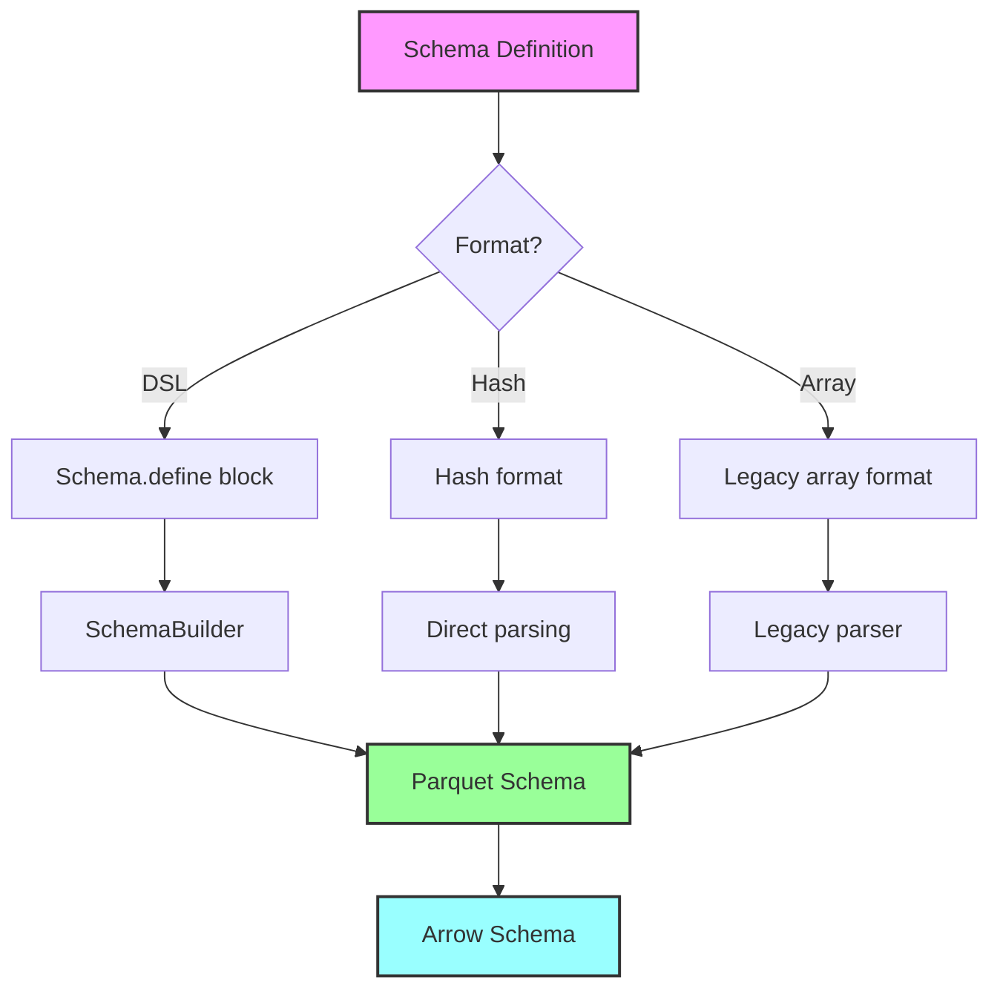

## Memory Management

### Memory Architecture

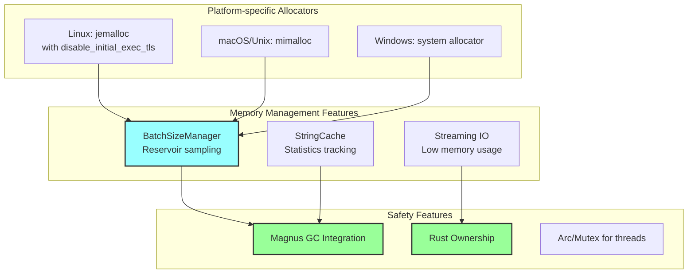

### IO Handling Architecture

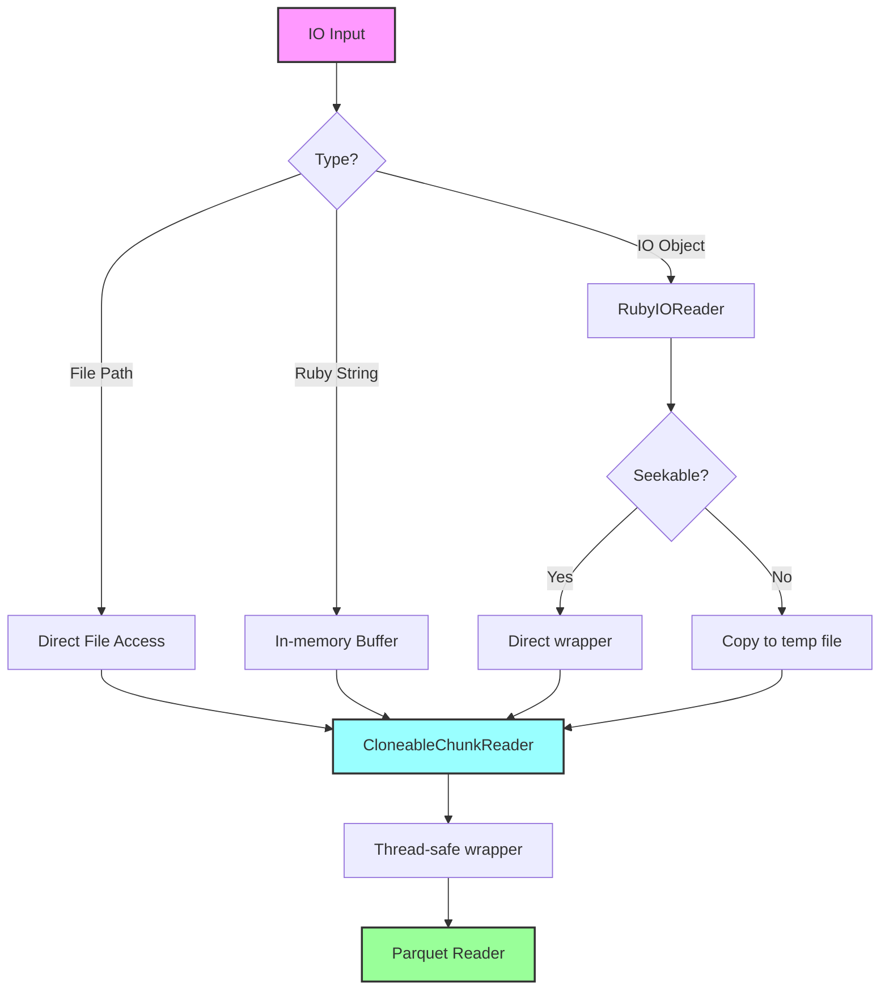

## Crate Descriptions

### 1. ext/parquet - Main FFI Extension

**Purpose**: Provides the FFI bridge between Ruby and Rust, exposing Parquet functionality to Ruby code.

**Key Components**:
- **lib.rs**: Entry point that registers Ruby module functions using Magnus
- **adapter_ffi.rs**: Thin FFI wrapper that parses Ruby arguments and delegates all logic to parquet-ruby-adapter modules
- **allocator.rs**: Platform-specific memory allocator configuration

**Responsibilities**:
- Ruby method registration and binding
- Argument parsing using Magnus scan_args
- Delegating all business logic to parquet-ruby-adapter modules
- Error type conversion from Rust to Ruby exceptions

**Key Features**:
- Minimal FFI surface area - contains only thin wrapper functions
- Complete separation between FFI layer and business logic
- All implementation details moved to parquet-ruby-adapter
- Clean, maintainable code structure

### 2. parquet-core - Core Library

**Purpose**: Language-agnostic core Parquet functionality that can be reused across different language bindings.

**Key Components**:
- **Reader**: High-performance file reader with row/column iteration
- **Writer**: Efficient file writer supporting various compression formats with dynamic batch sizing
- **Schema**: Type-safe schema representation with builder API
- **ParquetValue**: Comprehensive enum representing all Parquet data types
- **ParquetError**: Comprehensive error handling with context support
- **arrow_conversion**: Bidirectional conversion between Arrow arrays and ParquetValue
- **test_utils.rs**: Testing utilities (test builds only)

**arrow_conversion Module**:
- **Purpose**: Consolidates all type conversion logic between Arrow arrays and ParquetValues
- **Key Functions**:
  - `arrow_to_parquet_value`: Converts a single value from an Arrow array to ParquetValue
  - `parquet_values_to_arrow_array`: Converts a vector of ParquetValues to Arrow arrays
  - `append_parquet_value_to_builder`: Incremental building for complex scenarios
- **Features**:
  - Handles all primitive types with automatic upcasting (e.g., Int8->Int32)
  - Complex type support (structs, lists, maps)
  - Proper null bitmap handling for collections
  - Decimal256 conversion using BigInt
  - Efficient batch conversions
- **Benefits**:
  - Eliminates 900+ lines of code duplication between reader and writer
  - Single source of truth for type conversions
  - Easier to maintain and test
  - Consistent behavior across read/write operations

**Traits**:
- `SchemaInspector`: Provides methods for examining and querying schemas

**Note**: The crate uses concrete types rather than abstract I/O traits:
- Reader uses `parquet::file::reader::ChunkReader` directly
- Writer uses `std::io::Write + Send` directly
- Schema building is implemented directly in language adapters

**Design Philosophy**:
- Zero-cost abstractions using Rust's trait system
- Separation of concerns between core logic and language bindings
- Efficient memory usage with streaming operations
- Type safety enforced at compile time
- DRY principle - no duplicate conversion logic

### 3. parquet-ruby-adapter - Ruby Integration

**Purpose**: Bridges Ruby-specific functionality with the core library, implementing Ruby-specific type conversions and IO handling.

**Module Structure**:

**converter.rs - RubyValueConverter**:
- Handles Ruby to Parquet value conversions
- Complex type support (BigDecimal, Time, DateTime, UUID)
- Optional string caching for statistics
- Schema-guided type conversions
- Note: Not thread-safe due to Ruby's GIL requirements

**io.rs - RubyIOReader/Writer**:
- Implements Rust's Read/Write/Seek traits for Ruby objects
- Thread-safe wrappers with GIL management
- Support for non-seekable IO through temporary files

**chunk_reader.rs - CloneableChunkReader**:
- Enables parallel reading from various sources
- Critical for Parquet's multi-threaded architecture
- Abstracts over files and IO objects

**schema.rs - Schema Conversion**:
- Converts Ruby schema formats to Parquet schemas
- Supports multiple formats (DSL, hash, legacy array)
- Handles nested types (structs, lists, maps)
- Complex type parsing (e.g., "list<string>", "decimal(5,2)")
- Note: Cannot use SchemaBuilder trait due to Ruby Value not being Send/Sync

**string_cache.rs - StringCache**:
- Interns strings in Ruby VM using RString::to_interned_str()
- Thread-safe global cache with Arc<Mutex<HashMap>>
- Tracks cache hits/misses for performance statistics
- Returns interned strings as &'static str valid for Ruby VM lifetime
- Note: Primary benefit is Ruby VM memory savings, not Rust-side savings

**logger.rs - RubyLogger**:
- Integration with Ruby's logging system
- Validates logger methods and provides lazy evaluation

**batch_manager.rs - BatchSizeManager**:
- Dynamic batch size management using reservoir sampling
- Samples first 100 rows to estimate average size
- Adjusts batch size to stay within memory threshold (80% target)
- Minimum batch size of 10 rows

**metadata.rs - Metadata Handling**:
- RubyParquetMetaData wrapper for IntoValue trait
- parse_metadata function for reading file metadata
- Converts Parquet metadata to Ruby-friendly format

**types.rs - Type Definitions**:
- ParserResultType enum (Hash/Array output formats)
- WriterOutput enum for file/tempfile handling
- Argument structs (ParquetWriteArgs, RowEnumeratorArgs, ColumnEnumeratorArgs)
- Common type definitions used across modules

**utils.rs - Utility Functions**:
- Argument parsing helpers (parse_parquet_write_args)
- Memory estimation functions (estimate_parquet_value_size, estimate_row_size)
- Compression parsing (parse_compression)
- Enumerator creation helpers

**reader.rs - Reading Operations**:
- each_row function for row-wise iteration
- each_column function for column-wise iteration
- Handles file and IO object inputs
- Manages streaming readers and chunk readers
- Supports projection (column selection)

**writer.rs - Writing Operations**:
- create_writer function for file/IO initialization
- finalize_writer function for closing and cleanup
- write_rows function for row-oriented data writing
- write_columns function for column-oriented data writing
- Handles temporary file creation for IO objects
- Manages batch writing and memory thresholds

## Key Design Patterns

### 1. FFI Bridge Pattern

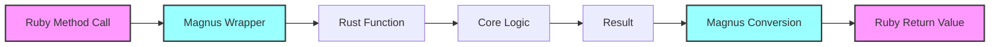

### 2. Iterator Pattern

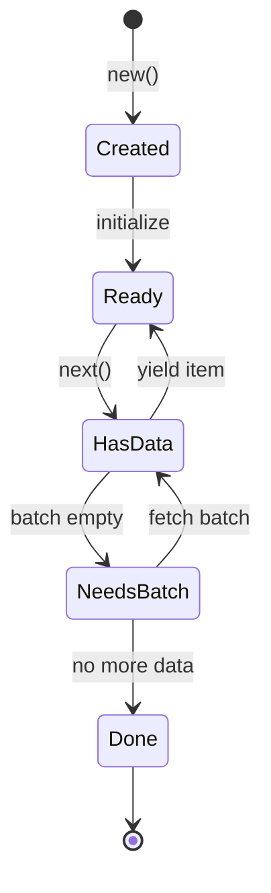

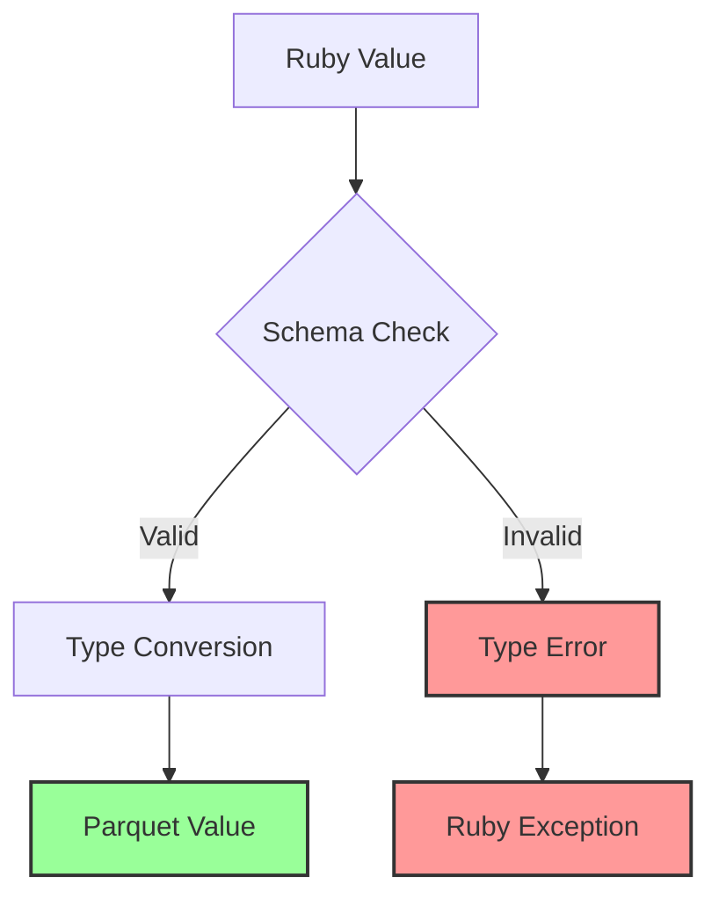

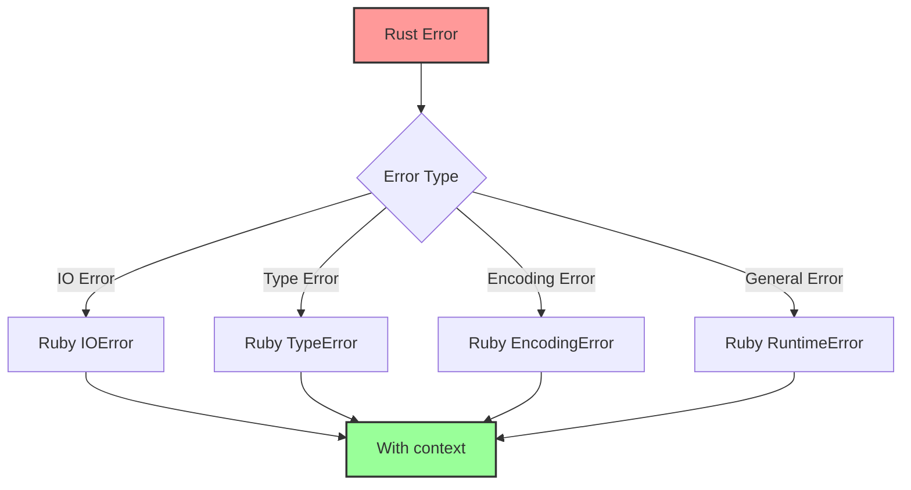
